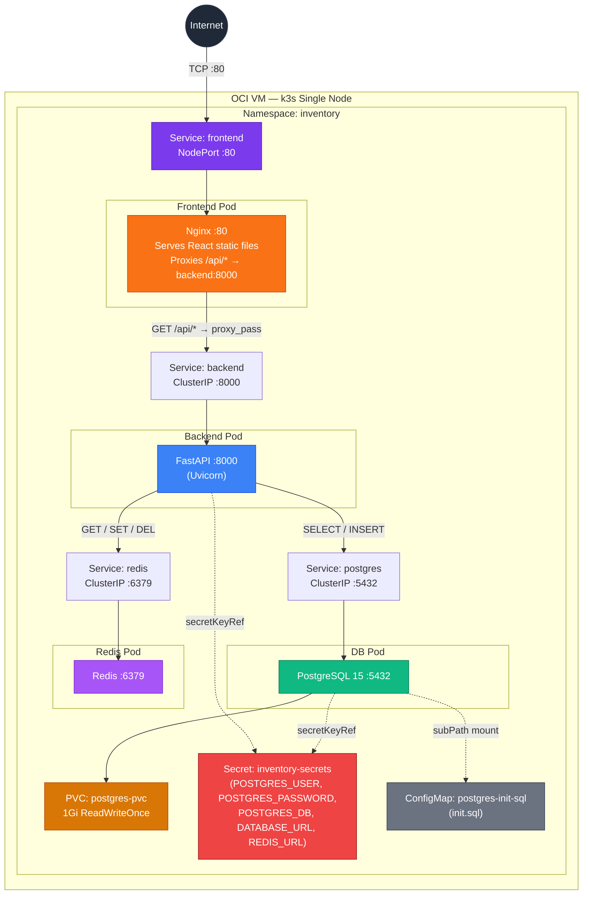
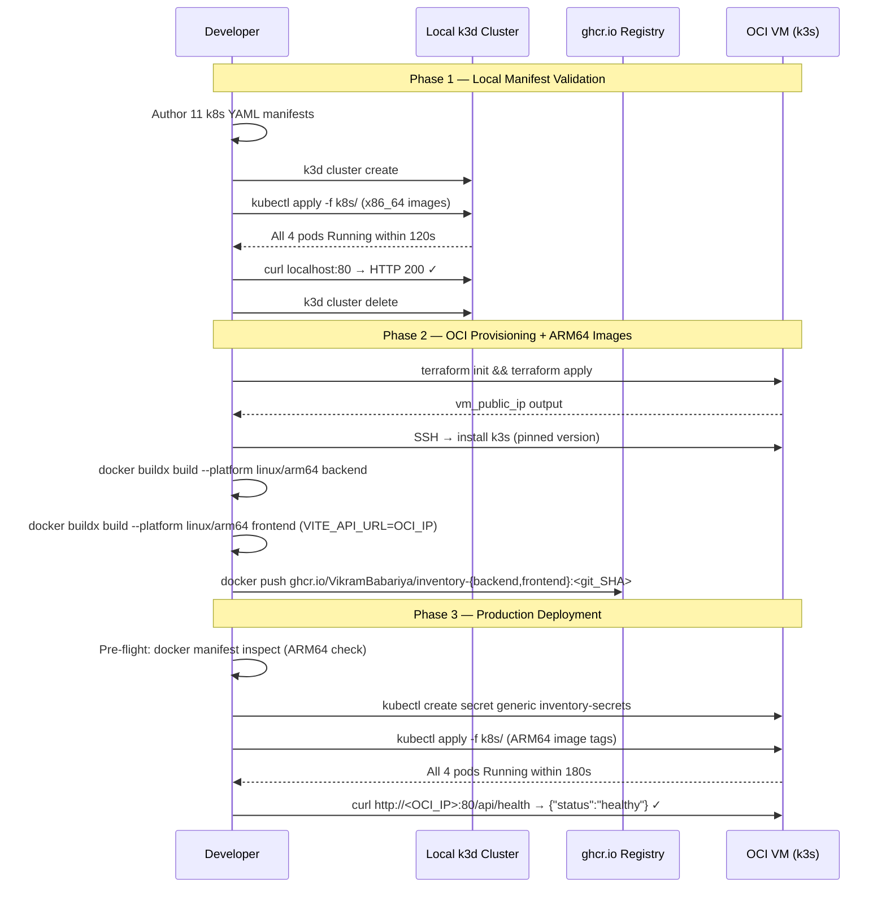

# Design Document — k8s-migration

## Overview

This document describes the technical design for migrating the inventory management system from Docker Compose to Kubernetes. The application stack (FastAPI backend, React/Nginx frontend, PostgreSQL 15, Redis) and all existing Dockerfiles are unchanged. The migration targets a single-node k3s cluster on Oracle Cloud Infrastructure (OCI) Always Free Tier (VM.Standard.A1.Flex, ARM64), provisioned via Terraform. All Kubernetes resources live in the `inventory` namespace.

The migration is structured in three phases:
- **Phase 1** — Author and validate all manifests against a local k3d cluster using x86_64 images.
- **Phase 2** — Provision OCI infrastructure with Terraform, build and push linux/arm64 images to ghcr.io.
- **Phase 3** — Apply manifests to the OCI k3s cluster and verify end-to-end connectivity at the public IP.

CI/CD, TLS, custom domains, and monitoring are explicitly out of scope.

---

## Architecture

### Kubernetes Network Topology



### Traffic Flow

1. A browser hits the OCI VM's public IP on port 80. The OCI VCN Security List (Terraform-managed) allows TCP/80 from `0.0.0.0/0`. The OS iptables rule (applied manually) forwards it into the cluster.
2. The `frontend` NodePort Service routes traffic to the Frontend Pod's Nginx on port 80.
3. Nginx serves compiled React static assets for all non-API paths.
4. For `GET /api/*` requests, Nginx strips the `/api` prefix and proxies to the `backend` ClusterIP Service on port 8000.
5. The `backend` ClusterIP routes to the Backend Pod (FastAPI/Uvicorn).
6. FastAPI reads from / writes to PostgreSQL via the `postgres` ClusterIP, and caches reads/invalidates on writes via the `redis` ClusterIP.

### Dual-Firewall Architecture (OCI)

```
Internet
    │
    ▼
OCI VCN Security List  (Terraform-managed)
  Allow TCP 22   from 0.0.0.0/0        ← SSH
  Allow TCP 80   from 0.0.0.0/0        ← HTTP / NodePort
  Allow TCP 6443 from <operator_cidr>  ← k3s API
    │
    ▼
OCI VM OS iptables  (manually applied)
  -A INPUT -p tcp --dport 80   -j ACCEPT
  -A INPUT -p tcp --dport 6443 -j ACCEPT
    │
    ▼
k3s / kube-proxy
  NodePort → frontend Pod :80
```

Both firewall layers must allow a port for traffic to reach the Pod. This provides defence-in-depth: a misconfigured iptables rule does not expose the OCI tenant perimeter, and a misconfigured Security List does not expose the VM kernel's network stack.

### Phase Deployment Flow



---

## Components and Interfaces

### Namespace

| Resource | Kind | Details |
|---|---|---|
| `inventory` | Namespace | All resources below live here. Created via `namespace.yaml` manifest. |

### ConfigMap

| Resource | Kind | Details |
|---|---|---|
| `postgres-init-sql` | ConfigMap | Key: `init.sql` — verbatim copy of `db_init/init.sql` |

Mounted into the DB Pod at `/docker-entrypoint-initdb.d/init.sql` using `subPath: init.sql`. The PostgreSQL entrypoint executes scripts in this directory only when the data directory is empty (first boot), guaranteeing idempotency on restarts. The script uses `CREATE TABLE IF NOT EXISTS`, so it is safe if somehow run twice.

### Secret

| Resource | Kind | Keys |
|---|---|---|
| `inventory-secrets` | Secret | `POSTGRES_USER`, `POSTGRES_PASSWORD`, `POSTGRES_DB`, `DATABASE_URL`, `REDIS_URL` |

Created manually via `kubectl create secret generic` — never committed to source control. All five keys are referenced via `secretKeyRef` in the relevant Deployment manifests. No plaintext credential appears in any manifest file.

### PersistentVolumeClaim

| Resource | Kind | Details |
|---|---|---|
| `postgres-pvc` | PersistentVolumeClaim | `1Gi`, `ReadWriteOnce`, `storageClassName` unset |

Unset `storageClassName` ensures the same manifest works in both local k3d (Phase 1, binds to `standard`) and OCI k3s (Phase 3, binds to `local-path`) without modification. The DB Deployment's node affinity (OCI only) ensures the Pod is always scheduled on the same node as its PVC data after VM reboots.

### PostgreSQL Deployment

| Field | Value |
|---|---|
| Deployment name | `inventory-db` |
| Image | `postgres:15-alpine` |
| Replicas | 1 |
| Port | 5432 |
| Volume mount | `postgres-pvc` → `/var/lib/postgresql/data` |
| Init SQL mount | `postgres-init-sql` ConfigMap → `/docker-entrypoint-initdb.d/init.sql` (subPath) |
| Env vars | `POSTGRES_USER`, `POSTGRES_PASSWORD`, `POSTGRES_DB` from `inventory-secrets` |
| Readiness probe | `pg_isready`, initialDelay: 10s, period: 5s, timeout: 5s, failureThreshold: 5 |
| Node affinity (OCI) | `kubernetes.io/hostname` key — pins to single cluster node |
| Service | `postgres` ClusterIP, port 5432 |

### Redis Deployment

| Field | Value |
|---|---|
| Deployment name | `inventory-redis` |
| Image | `redis:alpine` |
| Replicas | 1 |
| Port | 6379 |
| Volumes | None — cache data is ephemeral |
| Readiness probe | `redis-cli ping`, period: 5s, timeout: 3s, failureThreshold: 3 |
| Service | `redis` ClusterIP, port 6379 |

### Backend Deployment

| Field | Value |
|---|---|
| Deployment name | `inventory-backend` |
| Image | `ghcr.io/VikramBabariya/inventory-backend:<git_SHA>` |
| Replicas | 1 |
| Port | 8000 |
| Env vars | `DATABASE_URL`, `REDIS_URL`, `POSTGRES_USER`, `POSTGRES_PASSWORD`, `POSTGRES_DB` from `inventory-secrets` via `secretKeyRef` |
| Init container | `busybox` — polls `postgres:5432` TCP with 60s timeout before main container starts |
| Readiness probe | `GET /health` HTTP 200, initialDelay: 15s, period: 10s, failureThreshold: 3 |
| Liveness probe | `GET /health`, initialDelay: 30s, period: 20s, failureThreshold: 3 |
| Volumes | None |
| Service | `backend` ClusterIP, port 8000, targetPort 8000 |

The init container replaces Docker Compose's `depends_on: condition: service_healthy`. Since Kubernetes does not natively propagate readiness between pods, the init container polls `nc -z postgres 5432` (or equivalent via `wget`/`sh`) in a loop until TCP connects, then exits 0 to unblock the main container.

### Frontend Deployment

| Field | Value |
|---|---|
| Deployment name | `inventory-frontend` |
| Image | `ghcr.io/VikramBabariya/inventory-frontend:<git_SHA>` |
| Build arg | `VITE_API_URL` set at `docker buildx build` time |
| Replicas | 1 |
| Port | 80 |
| Volumes | None |
| Readiness probe | `GET /` HTTP 200, port 80 |
| Service | `frontend` NodePort, port 80, targetPort 80 |

`VITE_API_URL` is a **build-time** argument baked into the compiled React bundle by Vite. For Phase 1 (k3d), it is set to `http://backend.inventory.svc.cluster.local:8000`. For Phase 3 (OCI), it must be set to the OCI public IP at image build time. This is the only difference between Phase 1 and Phase 3 frontend images.

The embedded `nginx.conf` proxies `/api/` paths to `http://backend:8000/`, resolving via in-cluster DNS. The proxy strips the `/api` prefix so the FastAPI backend receives requests at their native paths (e.g., `/products`, `/health`).

### Terraform Resources

| File | Purpose |
|---|---|
| `main.tf` | VCN, subnet, VM instance (VM.Standard.A1.Flex, 2 OCPUs, 12 GB), reserved public IP |
| `variables.tf` | Input vars: `region`, `instance_image_ocid`, `operator_cidr`, `reserve_public_ip`, `ssh_public_key` |
| `outputs.tf` | Output: `vm_public_ip` |
| `security.tf` | VCN Security List ingress rules: TCP 22 from `0.0.0.0/0`, TCP 80 from `0.0.0.0/0`, TCP 6443 from `operator_cidr` |
| `terraform.tfvars.example` | Template with all five variable stubs and inline comments |

---

## Data Models

### Kubernetes Resource Dependency Graph

```
inventory (Namespace)
├── inventory-secrets (Secret)           ← manual bootstrap, no manifest
├── postgres-init-sql (ConfigMap)        ← verbatim db_init/init.sql
├── postgres-pvc (PVC)
├── inventory-db (Deployment)            ← depends on: postgres-pvc, postgres-init-sql, inventory-secrets
│   └── postgres (ClusterIP Service)
├── inventory-redis (Deployment)         ← no dependencies
│   └── redis (ClusterIP Service)
├── inventory-backend (Deployment)       ← init container waits for postgres Service, needs inventory-secrets
│   └── backend (ClusterIP Service)
└── inventory-frontend (Deployment)      ← proxies to backend Service at runtime
    └── frontend (NodePort Service)
```

Apply order that respects these dependencies:
```
kubectl apply -f k8s/namespace.yaml
kubectl apply -f k8s/configmap-postgres-init.yaml
kubectl apply -f k8s/pvc-postgres.yaml
kubectl apply -f k8s/deployment-postgres.yaml
kubectl apply -f k8s/service-postgres.yaml
kubectl apply -f k8s/deployment-redis.yaml
kubectl apply -f k8s/service-redis.yaml
kubectl apply -f k8s/deployment-backend.yaml
kubectl apply -f k8s/service-backend.yaml
kubectl apply -f k8s/deployment-frontend.yaml
kubectl apply -f k8s/service-frontend.yaml
```
Or as a single command: `kubectl apply -f k8s/` (Kubernetes will retry until dependencies resolve).

### File Layout

```
k8s/
├── namespace.yaml                   # Namespace: inventory
├── configmap-postgres-init.yaml     # ConfigMap: postgres-init-sql
├── pvc-postgres.yaml                # PVC: postgres-pvc (1Gi RWO, no storageClassName)
├── deployment-postgres.yaml         # Deployment: inventory-db + node affinity
├── service-postgres.yaml            # ClusterIP Service: postgres :5432
├── deployment-redis.yaml            # Deployment: inventory-redis
├── service-redis.yaml               # ClusterIP Service: redis :6379
├── deployment-backend.yaml          # Deployment: inventory-backend + init container + probes
├── service-backend.yaml             # ClusterIP Service: backend :8000
├── deployment-frontend.yaml         # Deployment: inventory-frontend + readiness probe
└── service-frontend.yaml            # NodePort Service: frontend :80

terraform/
├── main.tf                          # VCN, subnet, VM instance, public IP
├── variables.tf                     # region, instance_image_ocid, operator_cidr, reserve_public_ip, ssh_public_key
├── outputs.tf                       # vm_public_ip output
├── security.tf                      # VCN Security List ingress rules
└── terraform.tfvars.example         # Template for variable values

docs/
├── archive/                         # Moved AWS-era docs
│   └── README.md                    # Archive context note
├── decisions/
│   ├── 010-nodeport-nginx-ingress.md
│   ├── 011-pvc-persistence-node-affinity.md
│   ├── 012-manual-secret-bootstrap.md
│   ├── 013-oci-dual-firewall.md
│   ├── 014-init-sql-configmap.md
│   └── 015-unset-storageclassname.md
├── runbooks/
│   ├── oci-terraform-setup.md
│   ├── k8s-operations.md
│   └── local-k3d-dev.md
└── backlog.md
```

### PostgreSQL Schema (unchanged from Docker Compose)

The schema is defined in `db_init/init.sql` and is not modified. It is mounted verbatim via the `postgres-init-sql` ConfigMap.

| Table | Purpose |
|---|---|
| `categories` | Lookup table — id, name, description |
| `products` | Master data — SKU, price, `current_stock` (denormalized cache) |
| `stock_movements` | Immutable ledger of all inventory deltas (never deleted) |

---

## Correctness Properties

*A property is a characteristic or behavior that should hold true across all valid executions of a system — essentially, a formal statement about what the system should do. Properties serve as the bridge between human-readable specifications and machine-verifiable correctness guarantees.*

This feature is primarily Infrastructure as Code (Kubernetes manifests and Terraform HCL) and build-process tooling. The prework analysis classified the vast majority of acceptance criteria as SMOKE or INTEGRATION checks — they verify one-time configuration or external service behavior and are not suitable for property-based testing.

After reflection, six testable properties were identified across the manifest corpus. Properties 1 and 2 were consolidated (all probe spec conformance across all three probed deployments is a single universal property). Properties 4 and 5 were consolidated (all secret references across all manifests is a single universal property). The remaining properties each provide unique validation value.

### Property 1: All Deployment Probe Fields Conform to Specification

*For any* Deployment manifest in `k8s/` that defines a readiness or liveness probe, each probe's field values (command/path, `initialDelaySeconds`, `periodSeconds`, `timeoutSeconds`, `failureThreshold`) SHALL exactly match the values specified in the requirements. No probe field may be absent where a value is required, and no probe field may differ from the specified value.

Specifically:
- `deployment-postgres.yaml` readiness probe: `pg_isready` exec, initialDelay=10, period=5, timeout=5, failureThreshold=5
- `deployment-redis.yaml` readiness probe: `redis-cli ping` exec, period=5, timeout=3, failureThreshold=3
- `deployment-backend.yaml` readiness probe: HTTP GET `/health`, initialDelay=15, period=10, failureThreshold=3
- `deployment-backend.yaml` liveness probe: HTTP GET `/health`, initialDelay=30, period=20, failureThreshold=3
- `deployment-frontend.yaml` readiness probe: HTTP GET `/`, port=80

**Validates: Requirements 2.9, 3.3, 4.5, 4.6, 5.6**

### Property 2: No Plaintext Credentials in Any Manifest

*For any* YAML file in `k8s/` and *for any* environment variable entry in that file whose `name` matches one of the five secret keys (`POSTGRES_USER`, `POSTGRES_PASSWORD`, `POSTGRES_DB`, `DATABASE_URL`, `REDIS_URL`), the entry SHALL use `valueFrom.secretKeyRef` pointing to `inventory-secrets`, and SHALL NOT have a direct `value` field containing a string.

**Validates: Requirements 2.5, 4.2, 6.3**

### Property 3: ConfigMap init.sql Round-Trip Fidelity

*For any* version of `db_init/init.sql`, the string stored in the `data["init.sql"]` field of `configmap-postgres-init.yaml` SHALL be byte-for-byte identical to the contents of `db_init/init.sql`. No character, whitespace, or encoding difference is acceptable, as even a single-byte difference could corrupt the SQL syntax and break first-boot schema initialisation.

**Validates: Requirements 7.1, 7.4**

### Property 4: All Kubernetes Resources Declare the `inventory` Namespace

*For any* YAML file in `k8s/` that defines a namespaced resource (Deployment, Service, PersistentVolumeClaim, ConfigMap), the `metadata.namespace` field SHALL be set to `inventory`. No resource manifest may omit the namespace field or set it to a different value.

**Validates: Requirements 1.1, 1.4**

### Property 5: Nginx API Prefix Stripping

*For any* URL path segment `{s}` composed of valid URL characters, the `location /api/` block in `frontend/nginx.conf` SHALL route a request for `/api/{s}` to `proxy_pass http://backend:8000/{s}`, stripping the `/api` prefix exactly once. Non-API paths (paths not starting with `/api/`) SHALL NOT be proxied — they SHALL be served from the static file root or fall through to `index.html`.

**Validates: Requirements 5.4**

### Property 6: PVC storageClassName is Absent

*For any* reading of `pvc-postgres.yaml`, the `spec.storageClassName` field SHALL be absent (not present in the YAML) or explicitly null. It SHALL NOT be set to any specific storage class name (e.g., `local-path`, `standard`), ensuring the manifest binds to the cluster default in both k3d and k3s environments.

**Validates: Requirements 2.6**

---

## Error Handling

### Pod Startup Failures

| Failure Mode | Symptom | Recovery |
|---|---|---|
| `inventory-secrets` absent | `CreateContainerConfigError` on backend and DB pods | Run secret bootstrap command; pods auto-recover once Secret exists |
| DB not ready when backend starts | Init container polls TCP/5432; backend blocked until ready or 60s timeout | If DB never becomes ready, init container fails → `Init:CrashLoopBackOff`; fix DB pod first |
| Image pull failure — wrong architecture | `exec format error` in logs | Rebuild with `--platform linux/arm64`; push new image; update manifest tag |
| Image pull failure — private registry | `ImagePullBackOff` with auth error | Set ghcr.io repo to public, or create `imagePullSecret` |
| PVC bind failure | Pod stuck in `Pending` — no matching storage class | Verify default storage class: `kubectl get storageclass` |
| init.sql not executed on first boot | Schema missing; backend returns 500 on DB queries | Verify data directory was empty on first start; manually exec `psql` and run script |
| Node affinity mismatch | DB pod stuck in `Pending` | Verify node label: `kubectl get nodes --show-labels`; update affinity to match actual hostname |

### Probe Failure Behavior

| Pod | Probe type | Failure consequence |
|---|---|---|
| DB | Readiness | Removed from `postgres` Service endpoints; backend init container retries TCP poll |
| Redis | Readiness | Removed from `redis` Service endpoints; backend degrades gracefully (cache miss, DB fallback) |
| Backend | Readiness | Removed from `backend` Service endpoints; Nginx returns 502 to browser |
| Backend | Liveness | kubelet restarts pod after 3 consecutive failures × 20s period = 60s |
| Frontend | Readiness | Removed from `frontend` Service endpoints; NodePort returns connection refused |

### Terraform Error Handling

| Error | Cause | Resolution |
|---|---|---|
| VCN CIDR conflict on `apply` | `10.0.0.0/16` already exists in tenancy | Change CIDR in `variables.tf` |
| VM shape unavailable | `VM.Standard.A1.Flex` capacity exhausted in Availability Domain | Retry in a different AD |
| Second `apply` not idempotent | Provider drift or manual OCI console changes | Run `terraform refresh` then `terraform plan` to inspect drift |
| SSH key not accepted | Wrong key format for OCI | Use RSA or ECDSA public key; paste the full key string |

### Image Architecture Mismatch

If a pod shows `exec format error` in `kubectl logs <pod> -n inventory`, the image was built for the wrong CPU architecture. Fix:
1. `docker buildx build --platform linux/arm64 ...` with a new `<git_SHA>` tag
2. `docker push ghcr.io/VikramBabariya/inventory-{backend,frontend}:<new_SHA>`
3. Update `image:` in the relevant Deployment manifest
4. `kubectl apply -f k8s/deployment-{backend,frontend}.yaml`

---

## Testing Strategy

### PBT Applicability Assessment

This feature is dominated by IaC (Kubernetes manifests, Terraform HCL) and operational process (runbooks, ADRs). The prework analysis identified six testable properties, described above. The primary test tool is YAML parsing via `PyYAML` (already in the project's Python ecosystem) rather than a full PBT framework with random input generation — because most properties are universal checks over a finite, static corpus of files.

One property (Property 5: Nginx prefix stripping) benefits from input generation. For the remainder, the "for all" quantification is over the finite set of k8s manifest files, making them exhaustive checks that are still correctly expressed as universal properties.

**Library**: `pytest` + `PyYAML` for manifest property tests. `hypothesis` for Property 5.

### Unit Tests — Manifest Structural Checks

These tests parse YAML files and assert correctness without a running cluster. They run in milliseconds and require no external dependencies.

```python
# Example test structure (pytest)
import yaml, pathlib

K8S_DIR = pathlib.Path("k8s")
SECRET_KEYS = {"POSTGRES_USER", "POSTGRES_PASSWORD", "POSTGRES_DB", "DATABASE_URL", "REDIS_URL"}

def load_all(filename):
    return list(yaml.safe_load_all((K8S_DIR / filename).read_text()))
```

Tests to implement:
- **Property 1** — Parse all five probe definitions; assert each field matches the spec exactly
- **Property 2** — Walk all env var entries in all manifest files; assert secret key names use `secretKeyRef` not `value`
- **Property 3** — Read `db_init/init.sql`; parse `configmap-postgres-init.yaml`; assert byte-for-byte equality
- **Property 4** — Parse every namespaced manifest; assert `metadata.namespace == "inventory"`
- **Property 6** — Parse `pvc-postgres.yaml`; assert `storageClassName` key is absent from `spec`

Each test maps to exactly one Correctness Property. Tag format: `# Feature: k8s-migration, Property {N}: {property_text}`

### Property-Based Test — Nginx Prefix Stripping

**Property 5** requires input generation to find edge cases:

```python
# Feature: k8s-migration, Property 5: nginx api prefix stripping
from hypothesis import given, settings
from hypothesis import strategies as st

# Generate URL-safe path segments: alphanumeric + /- _ . with optional query strings
path_segment = st.from_regex(r"[a-zA-Z0-9/_\-\.]{1,64}", fullmatch=True)

@given(path_segment)
@settings(max_examples=100)
def test_nginx_api_prefix_stripped(segment):
    # Start nginx container with frontend/nginx.conf + mock echo backend
    # Send GET /api/{segment}
    # Assert mock backend received GET /{segment} (not /api/{segment})
    pass  # Implementation: docker SDK or subprocess nginx test container
```

**Configuration**: 100 iterations minimum (driven by `@settings(max_examples=100)`).

Additional unit test examples for Property 5:
- `/api/products` → `backend:8000/products`
- `/api/products/1/movements` → `backend:8000/products/1/movements`
- `/api/health` → `backend:8000/health`
- `/` → served from static root (not proxied)
- `/assets/main.js` → served from static root

### Integration Tests (Manual — Per Phase)

These require a running cluster and are executed manually during each deployment phase.

**Phase 1 (k3d)**:
```bash
# Verify all pods reach Running within 120s
kubectl get pods -n inventory --watch

# Verify frontend is reachable
curl -I http://localhost:80

# Verify end-to-end API path through Nginx proxy
curl http://localhost:80/api/health
# Expected: {"status":"healthy","database":"connected","cache":"connected"}

# Verify product data (tests DB + Redis + backend)
curl http://localhost:80/api/products
```

**Phase 3 (OCI)**:
```bash
# Pre-flight: verify ARM64 manifests
docker manifest inspect ghcr.io/VikramBabariya/inventory-backend:<git_SHA>
docker manifest inspect ghcr.io/VikramBabariya/inventory-frontend:<git_SHA>

# Verify all pods reach Running within 180s
kubectl get pods -n inventory -w

# Verify public IP access
curl -I http://<OCI_PUBLIC_IP>:80
curl http://<OCI_PUBLIC_IP>:80/api/health

# Verify DB persistence (PVC survives pod restart)
kubectl delete pod -l app=inventory-db -n inventory
kubectl get pods -n inventory --watch
curl http://<OCI_PUBLIC_IP>:80/api/products  # data must still be present
```

### Terraform Validation

```bash
# Syntax and schema check
terraform validate

# Dry-run: inspect planned resources
terraform plan -out=tfplan

# Idempotency check: second plan must show 0 changes
terraform apply tfplan
terraform plan  # must output: No changes. Your infrastructure matches the configuration.
```

---
