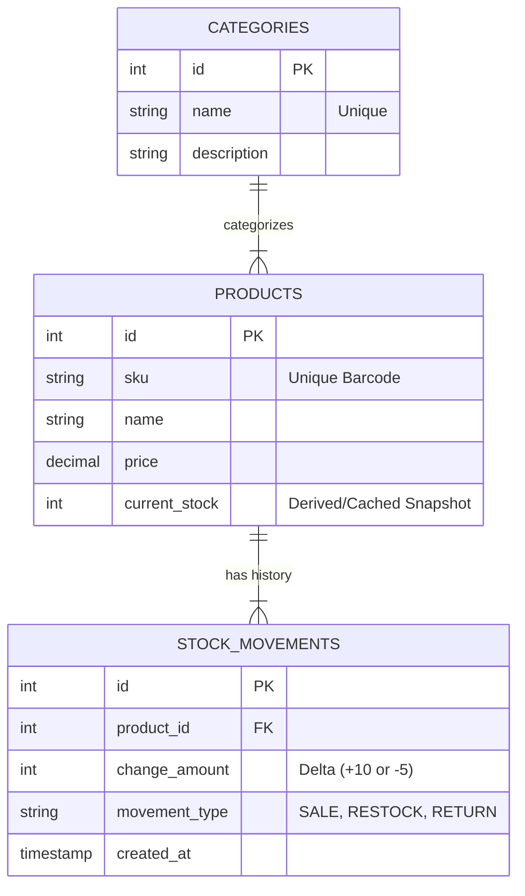

# Database Architecture & Schema

## 1. Overview
The inventory system uses a **Relational Database (PostgreSQL)** to manage product data, strict categorization, and a complete audit trail of stock movements.

## 2. Entity Relationship Diagram (ERD)
The following diagram illustrates the relationships using Crow's Foot notation:

## 3. Schema Definitions
### Categories
- **Purpose**: Strict grouping of products (e.g., Electronics, Furniture).

- **Constraint**: A product must belong to exactly one category.

### Products
- **Purpose**: The "Master Data" representing the item itself.

- **Key Field**: current_stock is a denormalized field. It represents the snapshot of inventory at the current moment for fast read performance.

### Stock Movements (The Ledger)
- **Purpose**: An immutable history of every change in inventory.

- **Key Field**: change_amount. We do not store "new total"; we store the "difference" (e.g., -2 or +50).