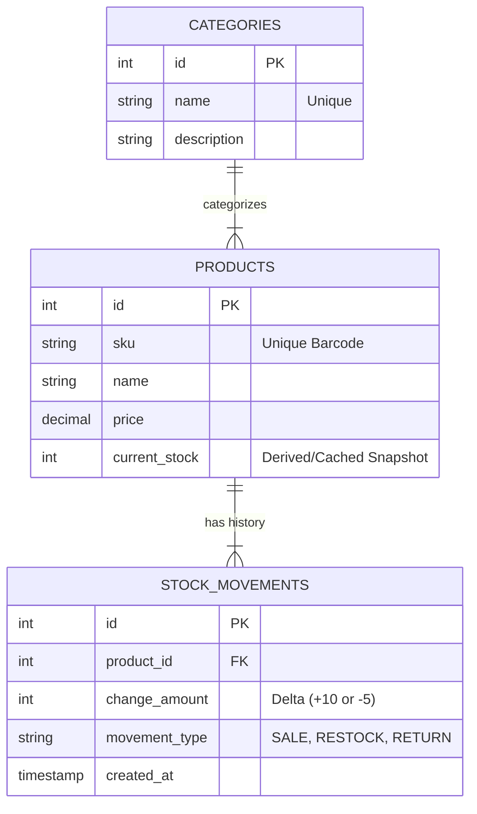

# Database Architecture & Schema

## 1. Overview
The inventory system uses **PostgreSQL** as its relational source of truth and **Redis** as an in-memory cache layer.

- **PostgreSQL** manages product data, categories, and the immutable stock movement ledger.
- **Redis** caches the results of expensive read queries (product list, movement history) with a 1-hour TTL, reducing PostgreSQL load on repeated reads. Cache is invalidated automatically on every write. See [ADR-006](../decisions/006-caching-stratagy.md) for the full caching strategy.

## 2. Entity Relationship Diagram (ERD)
The following diagram illustrates the relationships using Crow's Foot notation:

```mermaid
erDiagram
    CATEGORIES ||--|{ PRODUCTS : "categorizes"
    PRODUCTS ||--|{ STOCK_MOVEMENTS : "has history"

    CATEGORIES {
        int id PK
        string name "Unique"
        string description
    }
    PRODUCTS {
        int id PK
        string sku "Unique Barcode"
        string name
        decimal price
        int current_stock "Derived/Cached Snapshot"
    }
    STOCK_MOVEMENTS {
        int id PK
        int product_id FK
        int change_amount "Delta (+10 or -5)"
        string movement_type "SALE, RESTOCK, RETURN"
        timestamp created_at
    }
```

## 3. Schema Definitions
### Categories
- **Purpose**: Strict grouping of products (e.g., Electronics, Furniture).

- **Constraint**: A product must belong to exactly one category.

### Products
- **Purpose**: The "Master Data" representing the item itself.

- **Key Field**: current_stock is a denormalized field. It represents the snapshot of inventory at the current moment for fast read performance.

### Stock Movements (The Ledger)
- **Purpose**: An immutable history of every change in inventory.

- **Key Field**: change_amount. We do not store "new total"; we store the "difference" (e.g., -2 or +50).