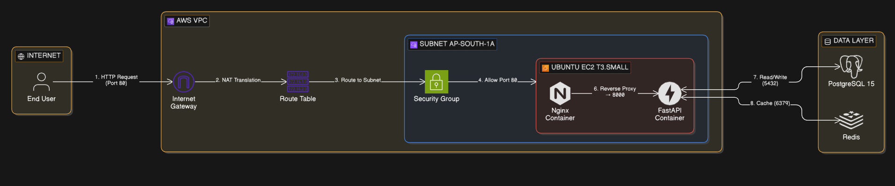

# Low-Level Design (LLD): Data Flow & Packet Routing

**Project:** Inventory Management Capstone
**Phase:** 2 - Manual AWS Deployment
**Region:** `ap-south-1` (Mumbai)

---

## 1. Architectural Principles & Routing Logic
Our data flow relies on three core networking concepts:
* **Network Address Translation (NAT):** The process of mapping our instance's private RFC 1918 IP address (`10.0.1.x`) to a Public IP address at the Internet Gateway.
* **Stateful Firewall (Security Group):** Connection tracking. If an inbound request is permitted on Port 80, the outbound response is automatically allowed, regardless of the outbound rule configuration.
* **Container Isolation:** The internal bridge network created by Docker, which keeps database traffic entirely off the AWS VPC network.

## 2. Inbound Data Flow (The User Journey)
Trace of a standard `GET /api/products` request from an external user to the backend database.

> **Key architectural note:** Nginx is embedded inside the frontend container (not a standalone service). The multi-stage Docker build compiles React into static files, then drops them into an Nginx image. Nginx serves the static files **and** proxies `/api/*` requests to the backend.

1. **The Internet:** User accesses the application via the Public IP (locally: `localhost:5173`).
2. **Internet Gateway (IGW):** Receives the packet. Performs a 1-to-1 NAT translation, converting the destination from the Public IP to the EC2 instance's Private IP.
3. **Route Table:** Verifies the destination private IP is within the `10.0.0.0/16` local route and directs it to the Public Subnet.
4. **Network ACL (NACL):** The stateless subnet boundary evaluates the packet. (Default rule: Allow All).
5. **Security Group:** The stateful instance boundary evaluates the packet against its rules. (Rule: Allow Port 80 `0.0.0.0/0` -> Permitted).
6. **Host OS:** The packet hits the EC2's Elastic Network Interface (ENI). The Docker daemon is listening on Host Port 80 (mapped to `5173:80` in the compose file).
7. **Docker Proxy:** Forwards the packet from the host port into the isolated Docker bridge network.
8. **Nginx (inside Frontend Container):** Receives the request and applies routing rules from `nginx.conf`:
   - Requests to `/api/*` → stripped of `/api/` prefix and proxied to `http://backend:8000/`
   - All other requests → served from `/usr/share/nginx/html` (the compiled React bundle), with SPA fallback to `index.html`
9. **FastAPI Container:** Processes the business logic and makes a TCP connection to PostgreSQL on Port 5432 to query data.

## 3. Outbound Data Flow (Server Updates & Responses)
* **Application Responses:** When FastAPI returns the JSON data, the response perfectly retraces the inbound path. The Security Group allows it through automatically because it is *stateful*. 
* **Server-Initiated Outbound (e.g., `sudo apt update`):** The EC2 instance sends a packet destined for `0.0.0.0/0`. The Route Table directs it to the IGW, which translates the Private IP back to the Public IP and routes it to the external Ubuntu update servers.

## 4. Internal Network Decision: Docker Bridge vs. Host Network

When designing the data flow inside the EC2 instance, we had to choose how containers communicate.

| Feature | Docker Bridge Network (Chosen) | Docker Host Network | Architectural Justification |
| :--- | :--- | :--- | :--- |
| **IP Allocation** | Containers get private `172.x.x.x` IPs. | Containers share the EC2's IP. | **Security:** Bridge isolates the DB. Host network exposes all container ports directly to the AWS ENI. |
| **Port Mapping** | Explicit (e.g., `-p 80:80`). | Implicit (Binds directly to host). | **Control:** Bridge forces us to deliberately choose which single port (80) faces the AWS VPC. |
| **DNS Resolution** | Automatic via container names. | Manual `localhost` mapping. | **Maintainability:** Nginx can route to `http://backend:8000` without knowing the exact IP. |

## 5. Visual Data Flow (Sequence Diagram)
