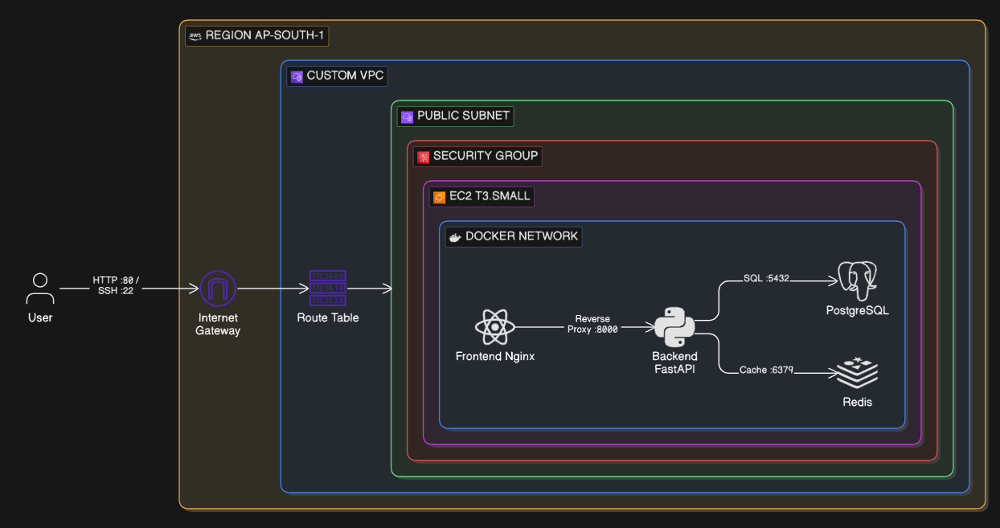

# Low-Level Design (LLD): Network Topology & Infrastructure

**Project:** Inventory Management Capstone
**Phase:** 2 - Manual AWS Deployment
**Region:** `ap-south-1` (Mumbai)

---

## 1. Cost Control & Boundary Management
Before provisioning, the following cost-control measures are mandatory:
* **Billing Alarm:** An AWS Budget alert is set at ₹500 to prevent accidental Free Tier overages.
* **Resource Lifecycle:** All resources (EC2, VPC, IGW) must be manually spun down if not actively in use during the ClickOps testing phase.
* **Lifecycle Strategy (FinOps):** The `t3.small` instance operates on a strict "Start/Stop" schedule. It is shut down outside of active development hours.
* **IP Address Trade-off:** To avoid idle charges associated with Elastic IPs, the architecture relies on an Ephemeral Public IP. The IP will change upon every instance restart, which is an accepted friction point to minimize the AWS bill to storage-only costs (EBS) during downtime.

## 2. Network Foundation (VPC & Subnets)
| Component | CIDR Block | Usable IPs | Architectural Justification (The "Why") |
| :--- | :--- | :--- | :--- |
| **Custom VPC** | `10.0.0.0/16` | 65,536 | **Isolation:** Creates a massive, private boundary (RFC 1918 standard). Prevents overlap with standard default VPCs (`172.31.0.0/16`). |
| **Public Subnet** | `10.0.1.0/24` | 251 | **Segmentation:** Carves out a smaller zone in `ap-south-1a`. We use a `/24` to reserve enough IPs for the host, while leaving room for future private subnets (e.g., `10.0.2.0/24`). AWS reserves 5 IPs per subnet. |

## 3. Traffic Routing & IP Reuse
To allow our private VPC to communicate with the outside world, we implement a routing doorway.

* **Internet Gateway (IGW):** Attached to the VPC to facilitate Network Address Translation (NAT) at the region edge.
* **Route Table:** Associates the Public Subnet with the IGW by routing all non-local traffic (`0.0.0.0/0`) to the IGW. 
* **IP Reuse Strategy:** The Docker engine on our host creates an internal bridge network (`172.x.x.x`). Instead of giving every container a public IP, Docker routes traffic through the host EC2's single Public IP, effectively acting as a NAT router for our backend services.

## 4. Security Boundaries (Stateful Firewall)
Attached to the EC2 host. We strictly follow the Principle of Least Privilege.

| Direction | Port | Protocol | Source/Destination | Justification |
| :--- | :--- | :--- | :--- | :--- |
| **Inbound** | 80 | HTTP | `0.0.0.0/0` (Internet) | Allows public web traffic to hit the Nginx reverse proxy. |
| **Inbound** | 22 | SSH | `<YOUR_STATIC_IP>/32` | **Strict Security:** Only allows the administrator's local machine to access the server. Never open Port 22 to the world. |
| **Outbound** | All | All | `0.0.0.0/0` | Allows the server to fetch OS updates, pull Docker images, and send outbound API requests. |

## 5. Compute Provisioning

Choosing the right host ensures stability during resource-intensive tasks like multi-stage Docker builds.

| Instance Type | vCPU | RAM | Cost Impact | Architectural Decision |
| :--- | :--- | :--- | :--- | :--- |
| `t3.micro` | 2 | 1 GB | Free Tier Eligible | High risk of Out of Memory (OOM) killer crashing the DB or React build. |
| `t3.small` | 2 | 2 GB | ~₹1,600/month | **Selected.** Provides the necessary overhead for running Vite, FastAPI, PostgreSQL, and Redis concurrently in containers. |

**OS/AMI:** Ubuntu 24.04 LTS (Industry standard, highly compatible with Docker).

---

## 6. Visual Architecture
