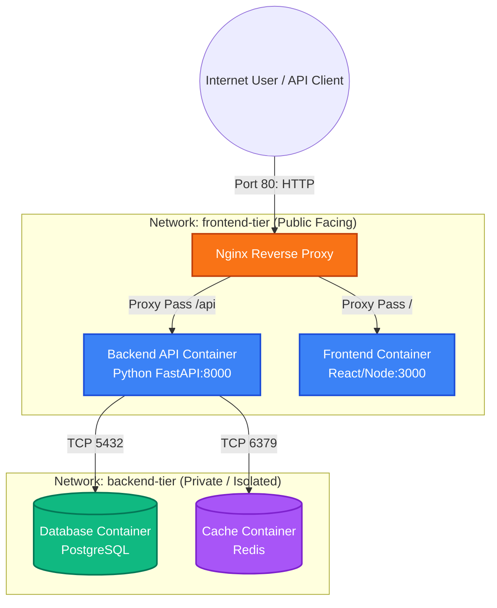
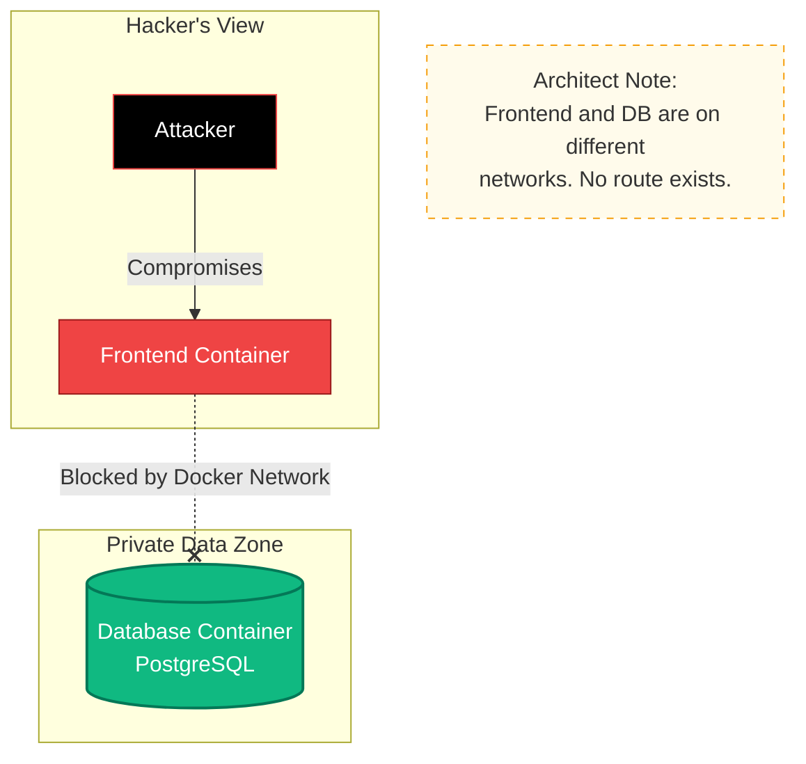
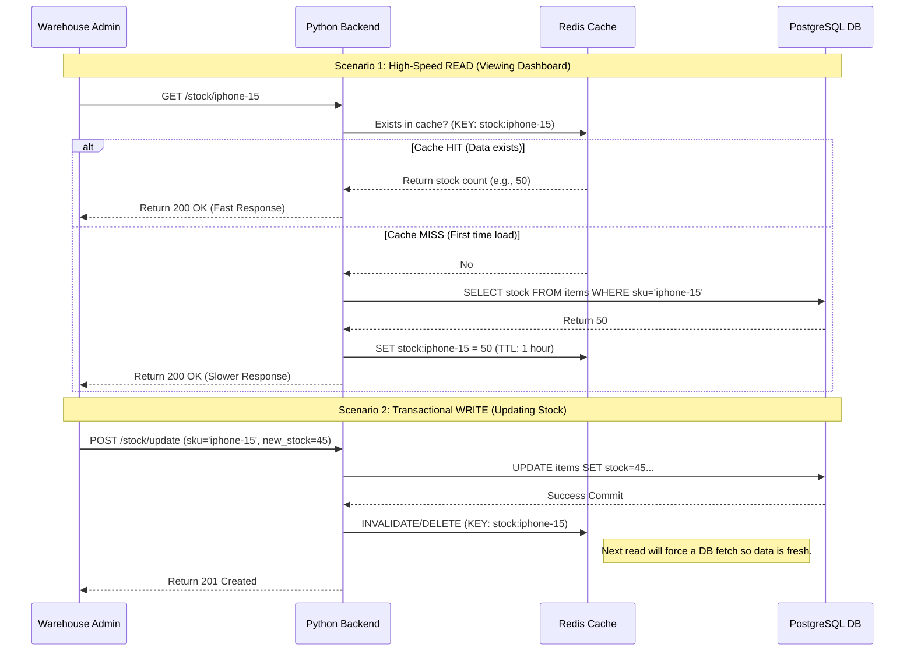

# System Architecture & Security Design

## 1. High-Level Network Topology
This diagram illustrates the separation between the public-facing frontend tier and the isolated backend tier using Docker networks.

## 2. Security Posture: Blast Radius Limitation
Even if the frontend is compromised, the database remains inaccessible due to network isolation.

## 3. Data Flow: Caching & Transaction Logic
Detailed sequence showing how the system handles high-speed reads and ensures data integrity during writes.

