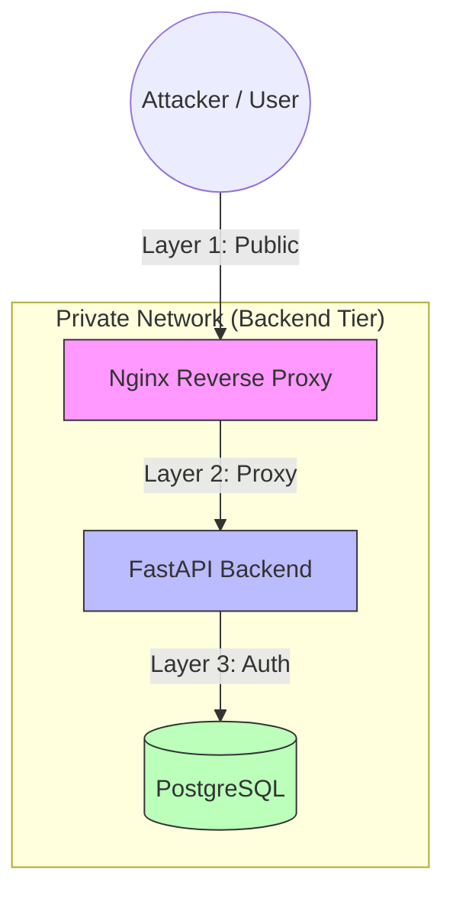

# 🛡️ Security Architecture & Best Practices

## 1. Overview: Defense in Depth

This project follows the **"Defense in Depth"** strategy. We do not rely on a single firewall or password. Instead, we layer multiple security controls so that if one fails, others are still in place to protect the data.



## 2. Container Security (Phase 4)

We prioritize **minimizing the attack surface** inside the container itself.

### 2.1. Non-Root User Execution

**Risk:** By default, Docker containers run as `root`. If an attacker exploits a code vulnerability (e.g., Remote Code Execution), they gain root access to the container and potentially the host. **Mitigation:** We explicitly create and switch to a low-privilege user (`appuser`) in the Dockerfile.

```Dockerfile
# backend/Dockerfile
RUN useradd -m appuser
USER appuser
```

### 2.2. Minimal Base Images (Alpine/Slim)

**Risk:** "Fat" images (like `node:20` or `python:3.12`) contain hundreds of system tools (curl, wget, netcat) that attackers use to explore networks and download malware. **Mitigation:**

**Frontend:** Uses `nginx:alpine` (Tiny, stripped OS).

**Backend:** Uses `python:3.12-slim` (Minimal Debian).

### 2.3. Multi-Stage Builds (Compiler Removal)

Risk: Production environments should not have compilers (`gcc`). Attackers use them to compile custom exploits or crypto-miners on compromised servers. **Mitigation:** We use multi-stage builds to install dependencies in a "Builder" stage, then discard that stage. The final production image **does not contain GCC.**

## 3. Network Security (Phase 3)

We use **Docker Networks** to enforce strict isolation rules.

### 3.1. Network Segmentation

We use two distinct networks:

1. `frontend-tier`: Public-facing. Allows the Frontend to talk to the Backend.

2. `backend-tier`: Private. Restricted to Backend, Database, and Cache.

### 3.2. Database Isolation

**Risk:** Exposing the database port (5432) to the public internet leads to brute-force attacks. **Mitigation:**

* The Database container is attached ONLY to the `backend-tier` network.
* The Frontend cannot reach the Database directly.
* In Production, we typically do not map port `5432` to the host machine at all.

### 3.3. Reverse Proxy (Nginx)

**Risk:** Exposing application servers (Uvicorn/Node) directly to the internet is dangerous as they are not designed to handle DDoS or malformed packets. **Mitigation:** Nginx acts as the "Gatekeeper." It handles all incoming traffic, sanitizes it, and only forwards valid API requests to the Backend.

## 4. Secrets Management

### 4.1. The ".env" Policy

* **Rule:** `.env` files contain sensitive credentials (passwords, API keys).
  
* **Implementation:** `.env` is added to `.gitignore` and NEVER committed to the repository.
  
* **Distribution:** Developers use `.env.example` to know which keys are required, then ask the team lead for the values securely (e.g., via Password Manager).

### 4.2. Production Injection

In production environments (AWS/CI/CD), secrets are injected as **Environment Variables** at runtime, not read from a file. This prevents passwords from sitting on the server's file system in plain text.

## 5. Future Roadmap (Missing Controls)
While the current posture is strong for an MVP, a full enterprise release would require:

* **HTTPS/TLS:** Currently, traffic is HTTP. We need to add an SSL Certificate (e.g., Let's Encrypt/Certbot) to Nginx.
  
* **Rate Limiting:** Configuring Nginx to block IPs that send too many requests (DDoS protection).
* **Vulnerability Scanning:** Integrating tools like Trivy or Snyk into the CI/CD pipeline to scan Docker images for known CVEs before deployment.
